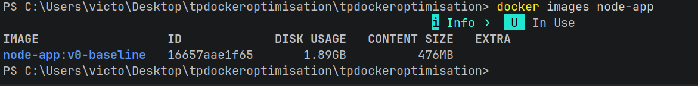
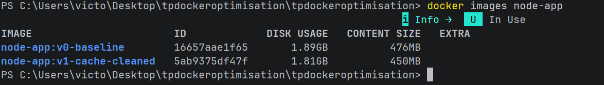
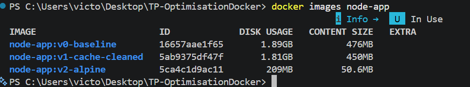
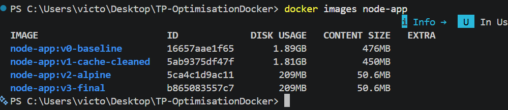

# Rapport d'Optimisation Docker - Node.js App

## 1. Tableau Comparatif des Étapes d'Optimisation

| Étape / Version | Tag de l'image | Taille disque (Uncompressed) | Taille réelle (Content Size) | Gain vs Baseline |
| :--- | :--- | :--- | :--- | :--- |
| **Étape 0 : Baseline** | `node-app:v0-baseline` | 1.89 GB | 476 MB | 0% |
| **Étape 1 : Nettoyage & Cache** | `node-app:v1-cache-cleaned` | 1.81 GB | 450 MB | -4.2% |
| **Étape 2 : Image Alpine + Prod deps** | `node-app:v2-alpine` | 209 MB | 50.6 MB | **-88.9%** |
| **Étape 3 : Multi-stage & Sécurité** | `node-app:v3-final` | 209 MB | 50.6 MB | **-88.9% (Sécurité renforcée)** |

---

## 2. Analyse Détaillée des Optimisations Réalisées

### Étape 0 : Image Baseline (Identification des anti-patterns)
- **Problèmes identifiés :**
  - Utilisation de `node:latest` (base Debian complète, extrêmement lourde : ~1.89 GB).
  - Copie du dossier `node_modules` de l'hôte (`COPY node_modules ./node_modules`), risquant des incompatibilités d'architecture OS.
  - Invalidation du cache Docker : `COPY . /app` exécuté avant `RUN npm install`.
  - Installation superflue de paquets système de compilation (`build-essential`, `locales`) et commande inutile `npm run build`.
  - Risque de sécurité : exécution en `USER root` et exposition de multiples ports inutilisés (`EXPOSE 3000 4000 5000`).

  

### Étape 1 : Nettoyage, .dockerignore et Cache des Layers
- **Changements appliqués :**
  - Création d'un fichier `.dockerignore` excluant `node_modules`, `.git`, `.idea` et les fichiers de log.
  - Réorganisation des instructions : `COPY package*.json ./` suivi de `RUN npm install`, puis `COPY . .` afin d'exploiter le cache de couches lors des modifications de code métier (`server.js`).
  - Suppression de l'installation des paquets `apt-get` et restriction du port à `EXPOSE 3000`.
- **Impact :** Réduction du contexte de build et temps de reconstruction quasi instantané lors de l'édition du code source.

### Étape 2 : Changement d'Image de Base (Alpine) & Dépendances de Production
- **Changements appliqués :**
  - Remplacement de l'image de base Debian par `node:20-alpine`.
  - Définition de `ENV NODE_ENV=production`.
  - Remplacement de `npm install` par `npm ci --omit=dev` et ajout de `npm cache clean --force` pour éliminer les outils de développement (tels que `nodemon`).
- **Impact :** Réduction spectaculaire de la taille de l'image, passant de 1.81 GB à **209 MB** (soit une réduction de près de 89%).

### Étape 3 : Multi-stage Build & Durcissement de Sécurité
- **Changements appliqués :**
  - Mise en œuvre d'un build multi-étapes (`deps` pour l'installation, `runner` pour l'image finale).
  - Isolation des permissions : exécution de l'application sous l'utilisateur non privilégié `USER node`.
- **Impact & Justification de la taille :**
  - La taille reste identique à l'étape 2 (209 MB) car l'application est en JavaScript pur sans étape de compilation (comme TypeScript ou Webpack).
  - Le gain majeur réside dans la **sécurité (DevSecOps)** : la surface d'attaque est considérablement réduite et le conteneur ne tourne plus avec les privilèges `root`.

